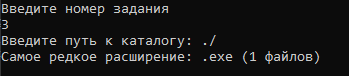

# Радостев Павел ИТС-2 Лабораторная №3

# Задание 1

## Задача 1

### Текст задачи

На основе списка, содержащего римские обозначения цифр от I до IX, получить их десятичные представления. Использовать Seq.map

### Алгоритм решения

1. Запросить ввод списка римских цифр
2. Перевести римские цифры в десятичное представление с помощью Seq.map
3. Вывести полученный список десятичных цифр

### Тестирование

# Задание 2

## Задача 1

### Текст задачи

Список содержит десятичные цифры. Составить число из чётных цифр. Использовать Seq.fold

### Алгоритм решения

1. Запросить ввод списка с проверкой на десятичную цифру
2. Отфильтровать чётные цифры из введённого списка
3. Соединить цифры в число функцией Seq.fold
4. Вывести полученное число

### Тестирование

# Задание 3

## Задача 1

### Текст задачи

Указать, файлы с каким расширением встречаются в указанном каталоге и его подкаталогах реже всего

### Алгоритм решения

1. Запросить ввод каталога у пользователя
2. Найти все файлы каталога и подкаталогов в виде массива
3. Получить расширения каждого файла
4. Сгруппировать расширения
5. Указать у каждой группы расширений количество сгруппированных расширений
6. Найти группу расширений по минимальной длине
7. Вывести ответ

### Тестирование

