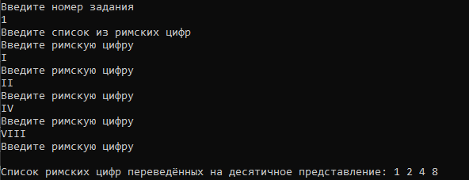
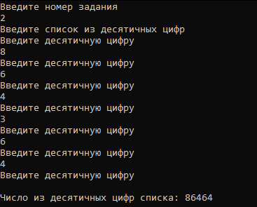

# Радостев Павел ИТС-2 Лабораторная №2

# Задание 1

## Задача 1

### Текст задачи

На основе списка, содержащего римские обозначения цифр от I до IX, получить
их десятичные представления

### Алгоритм решения

1. Запросить ввод списка римских цифр
2. Перевести римские цифры в десятичное представление с помощью List.map
3. Вывести полученный список десятичных цифр

### Тестирование

# Задание 2

## Задача 1

### Текст задачи

Список содержит десятичные цифры. Составить число из чётных цифр

### Алгоритм решения

1. Запросить ввод списка с проверкой на десятичную цифру
2. Отфильтровать чётные цифры из введённого списка
3. Соединить цифры в число функцией fold
4. Вывести полученное число

### Тестирование

